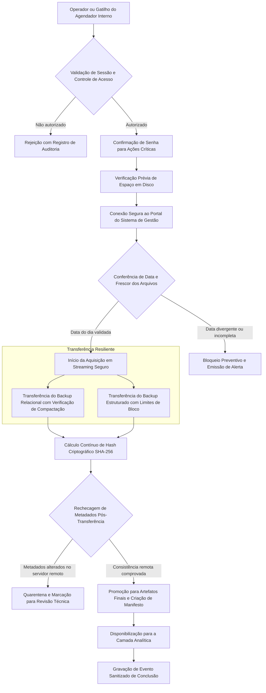

# Central de Integração de Dados KSI–BI

> **Repositório vitrine.** Apenas apresentação do projeto. O código-fonte é privado. Autor: Caio Alba de Camargo.

## 1. Visão geral e problema que resolve

A Central de Integração de Dados KSI–BI é uma aplicação autônoma de governança, aquisição e monitoramento projetada para assegurar o ciclo de vida da extração de dados do sistema de gestão corporativo para o ecossistema de Business Intelligence.

Em ambientes corporativos que dependem de dados analíticos diários, o processo de obtenção de cópias de segurança do ERP frequentemente sofre com a falta de visibilidade operacional, ausência de trilha de auditoria e dependência de rotinas cegas em segundo plano. Problemas como falhas silenciosas de autenticação no portal do fornecedor, aquisição inadvertida de backups defasados gerados em dias anteriores ou interrupção de transferências volumosas deixam os painéis de decisão desatualizados sem que a equipe técnica seja avisada a tempo.

A Central de Integração resolve essa vulnerabilidade estrutural ao fornecer uma camada completa de orquestração visual e programática. A plataforma combina uma interface web local intuitiva para operadores e analistas, controle rigoroso de acesso com múltiplos níveis de privilégio, validação estrita de data e frescor dos dados antes de qualquer transferência, verificação criptográfica de integridade e registro estruturado de eventos para auditoria, eliminando a opacidade da integração de dados.

## 2. Como funciona (fluxo ponta a ponta)

A aplicação opera através de um fluxo estruturado com portões de validação contínuos, garantindo que apenas dados comprovadamente íntegros e recentes sejam incorporados:

1. **Acesso Autenticado e Autorização:** O operador autentica-se na interface web local, onde o sistema avalia suas permissões por função. Ações de alto impacto, como disparo de download ou alteração de agendamentos, exigem reconfirmação explícita de senha.
2. **Checagem de Espaço e Sanidade:** Antes de qualquer requisição de dados pesados, o motor calcula a reserva de armazenamento livre requerida no volume local, impedindo o esgotamento do disco.
3. **Conferência Ativa no Portal de Origem:** A aplicação estabelece sessão com o portal do ERP e inspeciona a listagem de arquivos, exigindo a presença de ambos os backups gerados na data corrente do fuso horário corporativo. Qualquer divergência aborta a operação antes do tráfego de dados.
4. **Aquisição em Streaming com Verificação Criptográfica:** Os arquivos são baixados em fluxo contínuo. Durante o transporte, a aplicação valida cabeçalhos de integridade de compactação e calcula em tempo real o hash SHA-256.
5. **Portão de Pós-Conferência e Manifesto:** Após a conclusão dos fluxos, a listagem do portal remoto é consultada novamente para atestar que os arquivos não sofreram alteração durante a janela de transferência. O sistema promove os artefatos temporários e grava um manifesto imutável com os metadados da execução.
6. **Auditoria Unificada:** Todos os passos, tempos e status são registrados em trilhas de eventos estruturadas e sanitizadas.

## 3. Funcionalidades detalhadas

- **Painel de Controle Visual Responsivo:** Interface web com acompanhamento em tempo real de status do motor de integração, métricas de transferência, uso de armazenamento e eventos recentes.
- **Controle de Acesso Baseado em Funções (RBAC):** Sistema granular com três níveis de acesso bem definidos:
  - *Visualizador:* Consulta status operacional, agendamentos vigentes, logs de auditoria e métricas de desempenho sem capacidade de modificação.
  - *Operador:* Executa checagens prévias de conectividade, validações de início de transferência e disparos manuais de aquisição de dados, mediante confirmação de senha.
  - *Administrador:* Configura horários e dias da rotina de agendamento, cadastra e inativa usuários locais e gerencia parâmetros de segurança da aplicação.
- **Mecanismo de Reautenticação para Ações Sensíveis:** Exigência de digitação de senha pessoal do usuário logado antes de autorizar início de downloads, interrupções ou mudanças de calendário.
- **Proteção Contra Tentativas Repetidas de Invasão:** Bloqueio temporário progressivo de endereços e usuários após sucessivas falhas de login.
- **Validação Antecipada de Frescor (Gatekeeper de Dados):** Análise automatizada da página de origem para confirmar se os arquivos exibidos pertencem rigorosamente à data atual, evitando o uso de dados defasados.
- **Modo de Teste Preliminar (Amostragem Rápida):** Capacidade de executar uma transferência curta de amostragem de dados para validar conectividade, cabeçalhos e permissões sem incorrer no tempo de download completo.
- **Download Resiliente com Políticas de Tolerância:** Algoritmo com limites de tempo por tentativa e por execução total, intervalo exponencial entre retentativas para erros de rede transitórios e cancelamento seguro sem perda de diagnósticos.
- **Preservação de Evidências Parciais:** Retenção controlada de arquivos parciais interrompidos para análise de engenharia e diagnóstico de corrupção de rede.
- **Agendador de Tarefas Integrado:** Mecanismo de agendamento autônomo baseado em dias da semana e horários específicos no fuso horário corporativo.
- **Exportação de Diagnóstico Sanitizado:** Ferramenta que compila eventos recentes de sistema em um pacote estruturado, removendo automaticamente qualquer dado sensível para envio seguro a equipes de suporte ou revisão técnica.
- **Manifestos Imutáveis de Execução:** Geração de arquivos descritivos contendo identificador único de execução, data de solicitação, tamanho em bytes e hash SHA-256 de cada artefato obtido.

## 4. Fontes de dados / conteúdo e como são tratados

- **Portal Web de Backups do Sistema de Gestão:** Endpoint seguro de onde a aplicação obtém a listagem autenticada de cópias de segurança geradas pelo ERP corporativo.
- **Base Relacional Compactada:** Arquivo em formato gzip contendo a estrutura e os registros tabulares do sistema de gestão. É validado contra corrupção estrutural de cabeçalho e integridade de blocos durante a leitura.
- **Arquivo de Cópia Estruturada/Nativa:** Artefato contendo tabelas e esquemas para cargas dedicadas de bancos analíticos.
- **Tratamento em Memória e Armazenamento Temporário:** As transferências utilizam arquivos de tentativa com sufixos dedicados enquanto o download transcorre. Somente após a aprovação de todos os critérios de aceitação e cálculo de soma de verificação os arquivos são promovidos a artefatos definitivos.

## 5. Permissões e controle de acesso

- **Armazenamento Seguro de Credenciais de Usuários:** Senhas dos operadores e administradores são armazenadas em banco de dados isolado com função de derivação de chaves scrypt, dotada de alto fator de custo computacional e salteamento criptográfico aleatório por usuário.
- **Prevenção contra Ataques de Temporização:** Comparações de integridade de senha e verificação de tokens utilizam algoritmos de tempo constante para mitigar técnicas de análise de canal lateral.
- **Gerenciamento de Sessões com Expiração Controlada:** Tokens criptograficamente seguros vinculados ao registro de usuário, com expiração automática após período de inatividade e revogação imediata em caso de logout ou inativação cadastral.
- **Isolamento de Contas Técnicas:** As credenciais utilizadas pela aplicação para autenticar no portal do ERP não são expostas aos usuários da interface gráfica nem transitam pelo navegador do cliente.

## 6. Agendamento/automação e tratamento de falhas

- **Agendador Baseado em Thread Dedicada:** O serviço interno avalia minuto a minuto a correspondência com a janela autorizada, registrando o último minuto acionado para evitar disparos em duplicidade.
- **Abordagem Falha-Fechada (Fail-Closed):** Em qualquer cenário de ambiguidade (como divergência na data do portal, indisponibilidade temporária de um dos dois artefatos ou inconsistência de cabeçalho), o sistema interrompe o processamento preventivamente em vez de prosseguir com dados incompletos.
- **Recuperação de Falhas de Comunicação:** O adaptador de rede diferencia falhas permanentes (credencial rejeitada, endpoint inexistente) de falhas temporárias (timeout de resposta, perda de conexão), aplicando repetição com backoff progressivo apenas nas causas transitórias.
- **Cancelamento Gracioso Controlado:** Caso o operador solicite o encerramento da execução através do painel, o motor finaliza os streams de rede de forma limpa, preserva o estado intermediário e registra a motivação da parada.

## 7. Segurança e privacidade

- **Sanitização Integral de Logs e Eventos:** A estrutura de auditoria não registra senhas, parâmetros confidenciais presentes em URLs, chaves de autenticação, conteúdos de banco de dados ou dados pessoais de clientes corporativos.
- **Isolamento de Escuta de Rede:** Por padrão, a aplicação atua exclusivamente na interface de loopback local da máquina hospedeira. A liberação para acesso a partir de outras estações da rede local exige configuração deliberada de camada segura TLS (HTTPS) com certificado digital e regras restritivas no firewall corporativo.
- **Segregação de Dados Operacionais:** As configurações de ambiente, chaves mestras, bancos de usuários e diretórios de destino das cópias residem fora da árvore de código e do controle de versionamento.
- **Identificadores Únicos Universais (UUID):** Cada ciclo de execução recebe um identificador aleatório independente, garantindo correlação auditável sem expor informações de infraestrutura.

## 8. Tecnologias

- **Backend e Lógica de Domínio:** Python 3.11, estruturado sob os princípios de Arquitetura Limpa (divisão estrita entre domínio, casos de uso de aplicação e adaptadores de infraestrutura).
- **Interface e Servidor HTTP:** Servidor multithreading nativo com manipulador customizado de rotas, servindo páginas dinâmicas sem dependência de frameworks externos pesados.
- **Camada de Apresentação (Frontend):** HTML5 semântico, CSS3 corporativo com suporte a identidade visual e JavaScript vanilla assíncrono para comunicação via APIs RESTful.
- **Persistência Local e Autenticação:** SQLite3 operando com chaves estrangeiras ativas e transações seguras para gerenciamento de usuários e sessões.
- **Criptografia e Hashing:** Algoritmos scrypt para derivação de senhas, SHA-256 para integridade de arquivos e sessões, e HMAC para comparação segura.
- **Contratos e Validação:** Esquemas formais em JSON Schema para validação estrita de entradas, artefatos de dados e padrões de mensagens de erro.
- **Scripts de Suporte Operacional:** Scripts PowerShell com verificação de privilégios para instalação no ambiente do sistema operacional.

## 9. Resultados e benefícios

- **Governança e Transparência:** Fim do processamento invisível; toda a aquisição de dados do ERP passa a ter acompanhamento visual, métricas claras e trilha histórica.
- **Garantia de Qualidade dos Dados:** Eliminação do risco de relatórios de BI consumirem bases desatualizadas devido à conferência automatizada de datas e checagem de hash.
- **Segurança da Informação Elevada:** Separação rígida de papéis (RBAC) com rastreamento detalhado de cada ação executada por usuário.
- **Operação Descomplicada para o Suporte:** Disponibilização de botão de exportação sanitizada de diagnósticos, facilitando a resolução de incidentes sem expor dados confidenciais da empresa.
- **Proteção do Armazenamento do Servidor:** Verificação prévia de cota em disco que impede paralisações acidentais por falta de espaço durante transferências volumosas.

## 10. Limitações e próximos passos

- **Execução Condicionada a Sessão:** Atualmente, a inicialização está configurada para abertura no login do usuário operacional no sistema; a execução autônoma antes do login do sistema operacional está estruturada e aguarda a finalização da homologação de conta de serviço com privilégio restrito.
- **Integração das Fases Seguintes de Carga:** As etapas de restauração direta de bancos de dados locais e disparo de atualização em nuvem nos modelos do Power BI estão previstas nas especificações contratuais e preparadas para ativação modular nas fases subsequentes.
- **Mecanismo de Notificação Ativa:** Implementação de mensageria direta para equipes de suporte via e-mail e mensageiro corporativo para disparo de alertas imediatos caso a verificação do portal aponte inconsistências matinais.

---

Autor: [Caio Alba de Camargo](https://github.com/caioalba)
